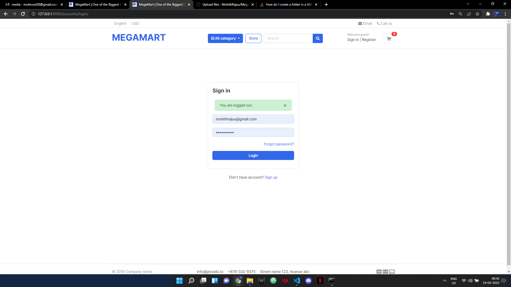
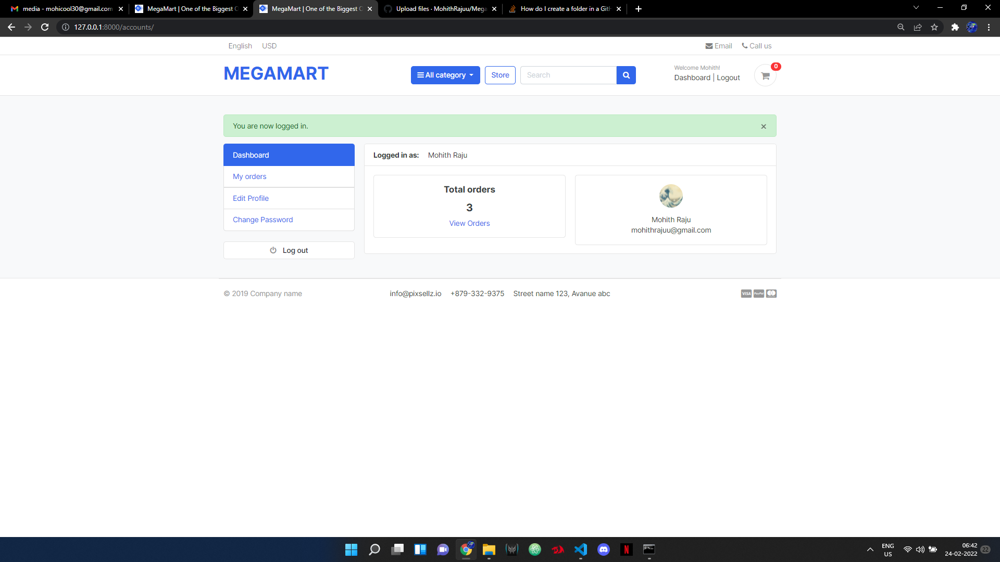
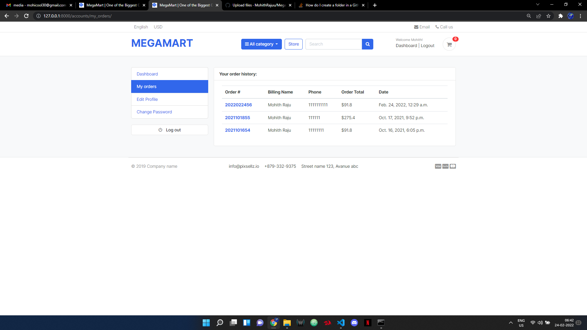
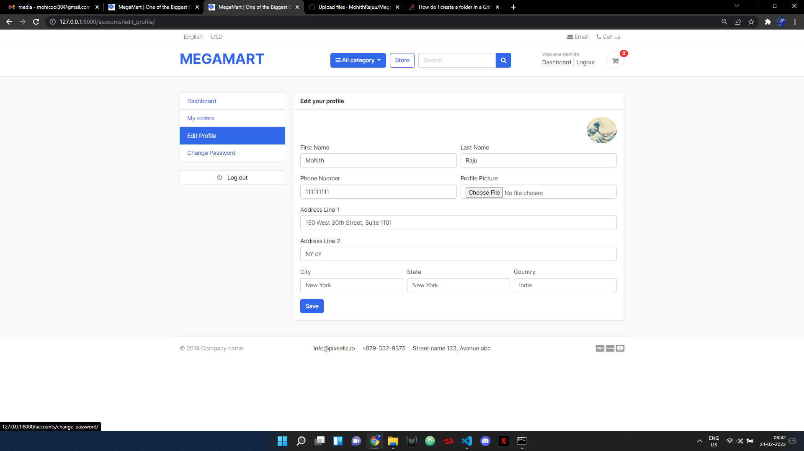
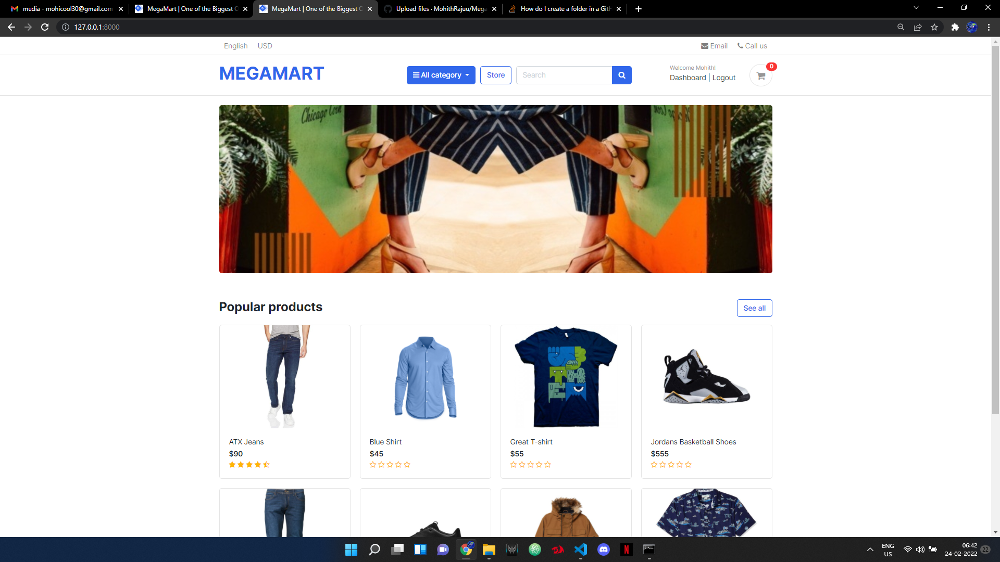
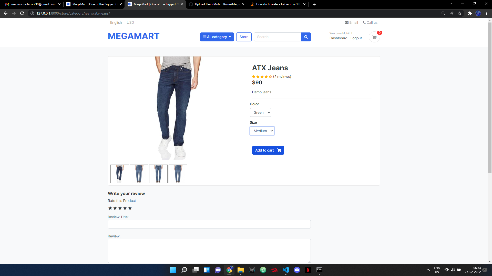
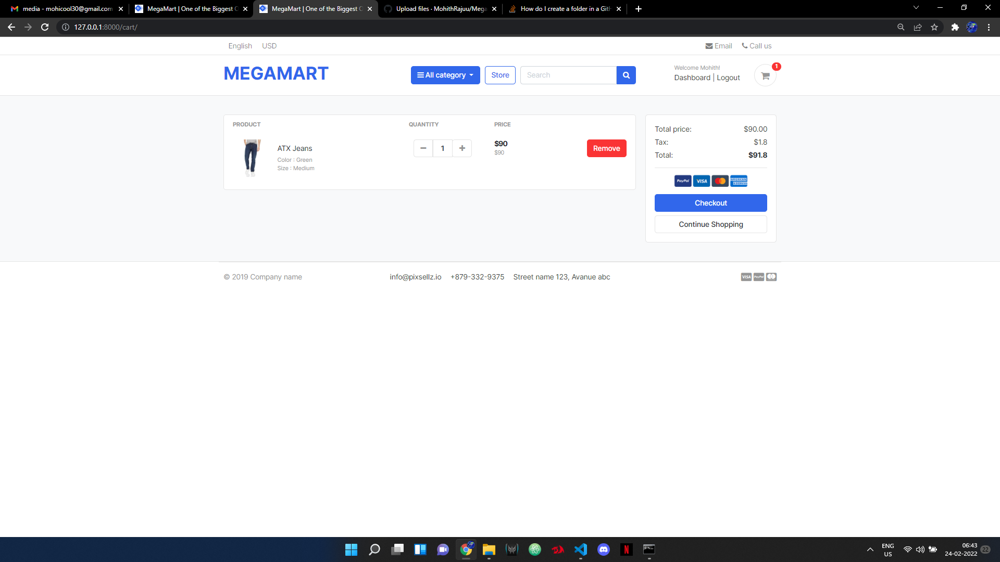
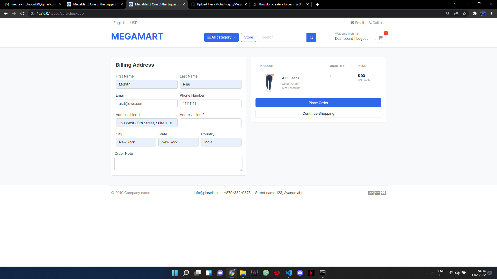
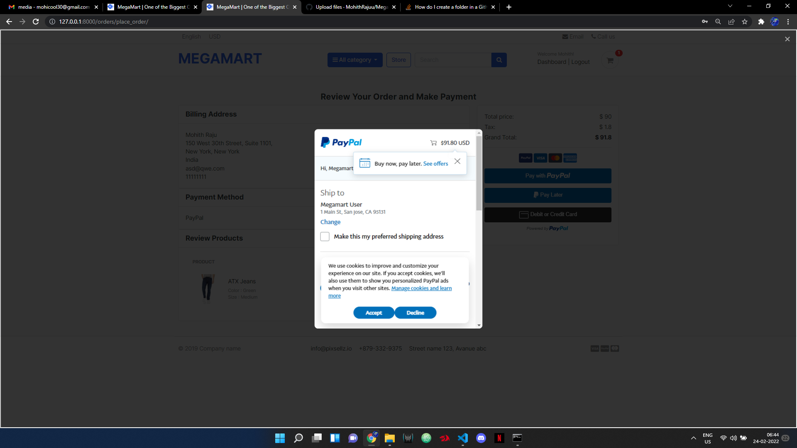
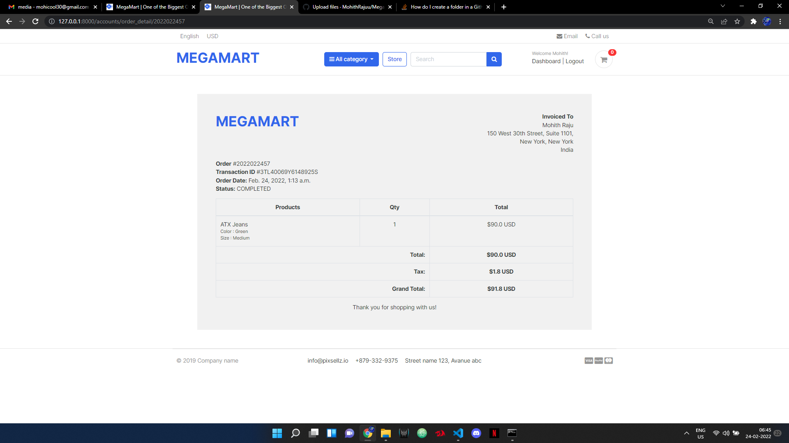

# Megamart-django
Clothing e-commerce website using Django, Bootstrap and Paypal

        ** PROJECT DEMO **

First, We have the login page.

Once, logged in you are welcomed to the Dashboard Screen.

View Previous orders,

and edit you profile by change name, email, address, profile photo, etc.

Clicking on the megamart icon gives you the Homepage.

You can navigate to store, select the products you like add it to the cart.

You can now proceed to the payment details and enter the billing address.

Now you can add the payment details and place order.

Once, the order is placed you will be directed to the order's invoice page.

